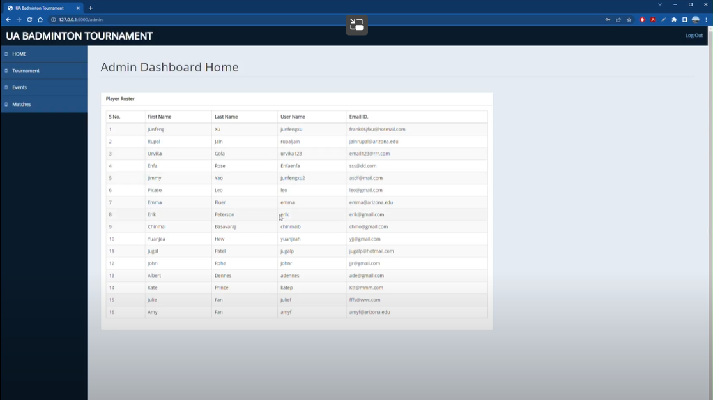
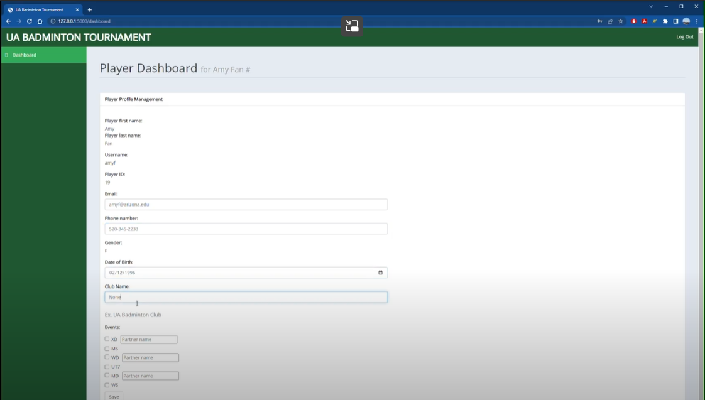
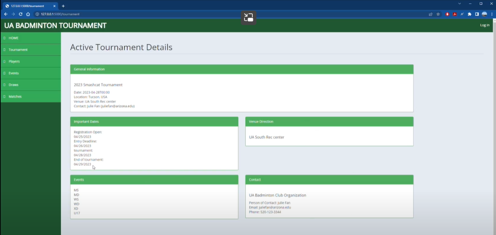

# UArizona Badminton Tournament Management Software

Software Engineering Project

Date: May 23, 2023

## Overview

We have implemented a tournament management system for the University of Arizona Badminton Club (UABC) that they can use to organize badminton tournaments.  

#### The Novelty of Our Project

The tournament management system we built  in this project has a clean and straight-forward user interface that is easy-to-use and with a short learning curve. The system also includes many automated features which can eliminate their manual efforts mentioned in the previous paragraph.

#### Customer Need

Our primary customer were the UA Badminton Club officers. They are the primary users of our software. Our secondary stakeholders are the badminton club members or any tournament participants. Our customers want a software that they can host and manage their badminton tournaments with. The software includes a client side and a host side. On the client side, a tournament participant is able to register their entries with the events (Men’s Singles, Men’s Doubles, Women’s Singles, Women’s Doubles, Mixed Doubles) they are competing in and input their partner’s name for doubles events. On the host side, the tournament organizer is able to create/set up a tournament and publish it to the public. They are also able to manage the participant list so that they can fix any incorrect entries, delete invalid entries. They can seed players and make bracket draws for each event. On the tournament day, the host side can update the match scores and advance the winners down the brackets. The client side can display the match results in real time for the participants to watch. The club officers are currently doing everything manually or using a software that is really complex to learn how to operate and with a high cost. They come to us with the request to design a new software for them that is with intuitive interfaces and can automate all their manual efforts.

#### Snapshots



*Fig. 1*: *Admin Dashboard*.



*Fig. 2*: *Player Dashboard*.



*Fig. 3*: *Public Page*.

## Execution

You will need to set up an appropriate coding environment.
Minimally, you should install:

* [flask]([https://git-scm.com/downloads](https://pypi.org/project/Flask/))
* [Python]([https://www.java.com/en/](https://www.python.org/downloads/))(3.11.3 or higher)

Please follow the below guidelines to run the program:

Compatibility:
Browser: Google Chrome, Microsoft Edge; OS: Windows, MAC

Run the app using 
```
flask --app app.py --debug run
```

Note: For database, we have used SQLAlchemy hosted on Amazon AWS server. 
